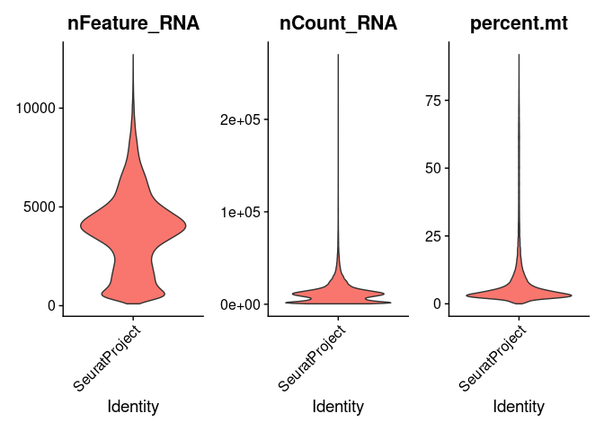
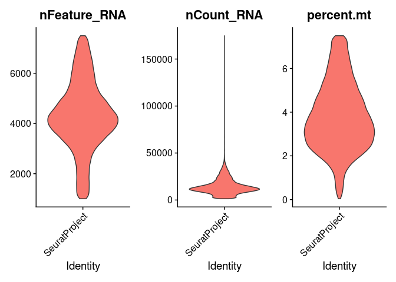
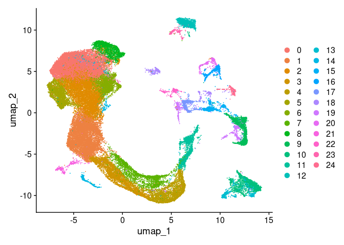
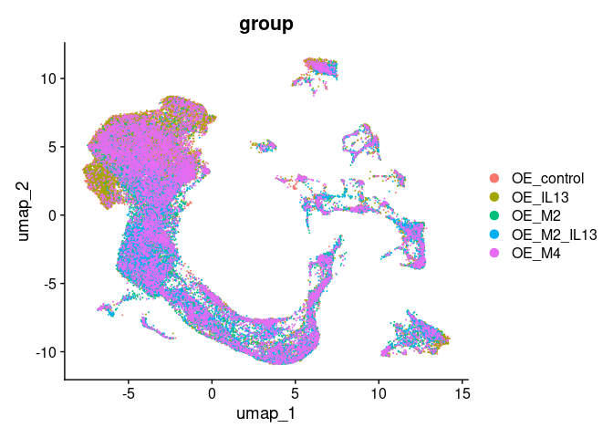
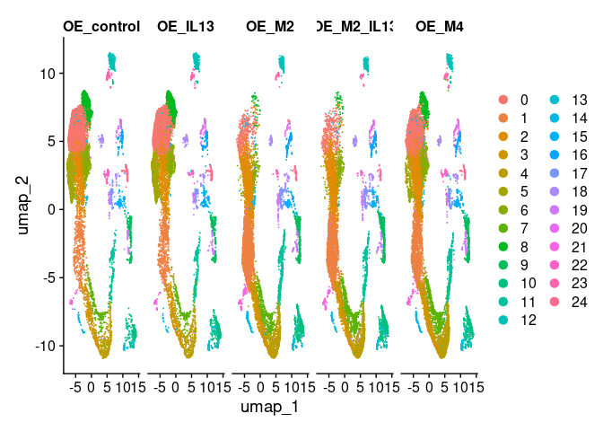
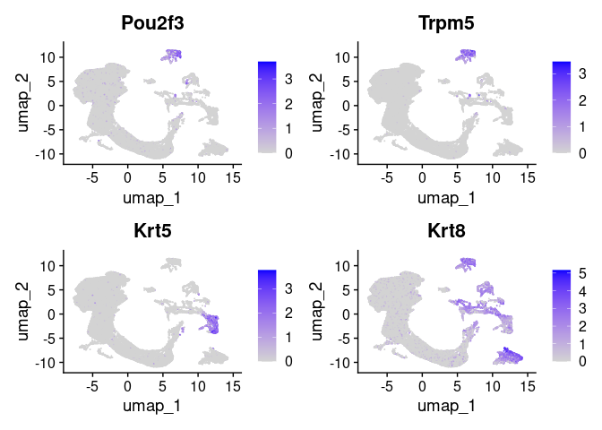
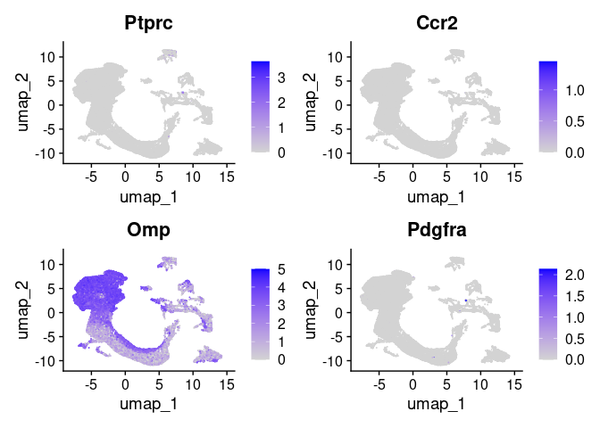
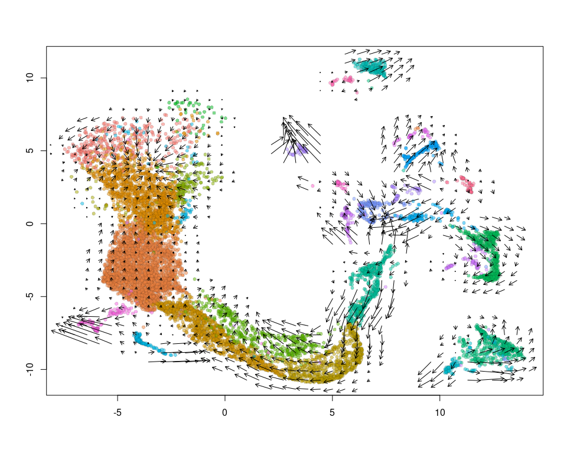

Read In Velocyto and 10x objects for Maya
================

- [Environment](#environment)
- [Read in Velocyto loom files](#read-in-velocyto-loom-files)
- [Read in 10X data](#read-in-10x-data)
- [Merge velocity data with corresponding 10x
  data](#merge-velocity-data-with-corresponding-10x-data)
  - [helper functions](#helper-functions)
    - [Function to rename velocity/loom
      cells](#function-to-rename-velocityloom-cells)
    - [Helper function to transfer
      assays](#helper-function-to-transfer-assays)
  - [Validate barcode match](#validate-barcode-match)
  - [Rename velocity cells](#rename-velocity-cells)
  - [Transfer assays to 10x objects](#transfer-assays-to-10x-objects)
  - [cleanup cleanup](#cleanup-cleanup)
- [Merge and Integrate](#merge-and-integrate)
  - [preprocessing](#preprocessing)
  - [integration](#integration)
  - [Clustering and UMAP embedding on integrated
    data](#clustering-and-umap-embedding-on-integrated-data)
- [Cluster exploration](#cluster-exploration)
  - [Save object](#save-object)
- [VelocytoR](#velocytor)
  - [Velocity on OE_M2](#velocity-on-oe_m2)

# Environment

``` r
library(tidyverse)
```

    ## ── Attaching core tidyverse packages ──────────────────────── tidyverse 2.0.0 ──
    ## ✔ dplyr     1.1.4     ✔ readr     2.1.4
    ## ✔ forcats   1.0.0     ✔ stringr   1.5.1
    ## ✔ ggplot2   3.4.4     ✔ tibble    3.2.1
    ## ✔ lubridate 1.9.3     ✔ tidyr     1.3.0
    ## ✔ purrr     1.0.2     
    ## ── Conflicts ────────────────────────────────────────── tidyverse_conflicts() ──
    ## ✖ dplyr::filter() masks stats::filter()
    ## ✖ dplyr::lag()    masks stats::lag()
    ## ℹ Use the conflicted package (<http://conflicted.r-lib.org/>) to force all conflicts to become errors

``` r
library(Seurat)
```

    ## Loading required package: SeuratObject
    ## Loading required package: sp
    ## 'SeuratObject' was built with package 'Matrix' 1.6.4 but the current
    ## version is 1.6.5; it is recomended that you reinstall 'SeuratObject' as
    ## the ABI for 'Matrix' may have changed
    ## 
    ## Attaching package: 'SeuratObject'
    ## 
    ## The following object is masked from 'package:base':
    ## 
    ##     intersect

``` r
library(SeuratWrappers)
library(SeuratDisk)
```

    ## Registered S3 method overwritten by 'SeuratDisk':
    ##   method            from  
    ##   as.sparse.H5Group Seurat

``` r
library(velocyto.R)
```

    ## Loading required package: Matrix
    ## 
    ## Attaching package: 'Matrix'
    ## 
    ## The following objects are masked from 'package:tidyr':
    ## 
    ##     expand, pack, unpack

Names of Maya’s samples

``` r
names <- c('OE_control','OE_IL13','OE_M2','OE_M2_IL13','OE_M4')
```

# Read in Velocyto loom files

Read in all objects as Velocity, convert to seurat, return list of
objects. There is some kind of bug in ReadVelocity where it is pulling
gene symbols, which are not guaranteed unique. see issue \#78. Will
overwrite read.loom.matrices with a function that appends accession
numbers to gene symbols to ensure uniqueness.

``` r
read.loom.matrices <- function(file) {
  # modified from velocytoR source code to account for non-uniqueness.
  cat('reading loom file via hdf5r...\n')
    f <- hdf5r::H5File$new(file, mode='r')
    cells <- f[["col_attrs/CellID"]][]
    genes <- paste0(f[["row_attrs/Gene"]][],'.',f[["row_attrs/Accession"]][]) # changed to gene.accession
    dl <- c(spliced="layers/spliced",
            unspliced="layers/unspliced",
            ambiguous="layers/ambiguous")
    if("layers/spanning" %in% hdf5r::list.datasets(f)) {
      dl <- c(dl, c(spanning="layers/spanning"))
    }
    dlist <- lapply(dl, function(path) {
      m <- as(t(f[[path]][,]),'dgCMatrix')
      rownames(m) <- genes; colnames(m) <- cells;
      return(m)
    })
    f$close_all()
    return(dlist)
}
```

Actually read in the looms and convert to list of seurat objects. Also
add some basic group metadata

``` r
seu.velocity.list <- lapply(names, function(name){
  dir <- paste0('./count/',name,'/velocyto/')
  # Assumes a single loom file per library
  loom.filename <- list.files(dir, pattern='*.loom')
  vel.object <- read.loom.matrices(file=paste0(dir,loom.filename))
  seu.object <- as.Seurat(x=vel.object)
  # Add metadata
  seu.object$group <- name
  return(seu.object)
})
```

    ## reading loom file via hdf5r...
    ## reading loom file via hdf5r...
    ## reading loom file via hdf5r...
    ## reading loom file via hdf5r...
    ## reading loom file via hdf5r...

# Read in 10X data

``` r
seu.10x.list <- lapply(names, function(name){
  dir <- paste0('./count/',name,'/outs/')
  raw.matrix <- Read10X(dir)
  seu.object <- CreateSeuratObject(counts=raw.matrix)
  # add metadata
  seu.object$group <- name
  return(seu.object)
})
```

# Merge velocity data with corresponding 10x data

## helper functions

### Function to rename velocity/loom cells

Velocity/Loom seems to have named cells in the form library:Barcodex,
e.g., KO:AAACCCATCCCTCTCCx. Seurat appends a dash for whatever reason i
suppose in case of nonuniqueness which is actually relatively
improbable.

``` r
ConvertVelocityCellToSeuratCell <- function(vector) {
  list <- lapply(vector, function(name) {
    name <- strsplit(name, ':')[[1]][2]
    name <- substr(name,1,nchar(name)-1)
    name <- paste0(name,'-1')
    return(name)
  })
  return(unlist(list))
}
```

### Helper function to transfer assays

Three assays come in the loom file: spliced, unspliced, and ambiguous.

``` r
ImportVelocityAssays <- function(Seurat10xObj, SeuratVelocityObj) {
  # Requires that the cell names have been matched already
  # Returns an object with all the data from both
  Seurat10xObj[['spliced']] <- SeuratVelocityObj[['spliced']]
  Seurat10xObj[['unspliced']] <- SeuratVelocityObj[['unspliced']]
  Seurat10xObj[['ambiguous']] <- SeuratVelocityObj[['ambiguous']]
  return(Seurat10xObj)
}
```

## Validate barcode match

One predicts that the converted names for the loom-Seurat objects will
be identical to names in the Seurat10x objects. If this is not the case
there is a problem.

``` r
for(i in 1:length(names)){
  seu.10x.obj <- seu.10x.list[[i]]
  seu.vel.obj <- seu.velocity.list[[i]]
  print(names[i])
  print(setequal(ConvertVelocityCellToSeuratCell(Cells(seu.vel.obj)), Cells(seu.10x.obj)))
  rm(seu.vel.obj)
  rm(seu.10x.obj)
}
```

    ## [1] "OE_control"
    ## [1] TRUE
    ## [1] "OE_IL13"
    ## [1] TRUE
    ## [1] "OE_M2"
    ## [1] TRUE
    ## [1] "OE_M2_IL13"
    ## [1] TRUE
    ## [1] "OE_M4"
    ## [1] TRUE

## Rename velocity cells

``` r
seu.vel.renamed.list <- lapply(seu.velocity.list, function(seu.vel.obj){
  seu.vel.renamed.obj <- RenameCells(seu.vel.obj,
                                     new.names=ConvertVelocityCellToSeuratCell(Cells(seu.vel.obj)))
})
```

## Transfer assays to 10x objects

``` r
seu.10x.vel.list <- lapply(1:length(names), function(i){
  seu.10x.obj <- seu.10x.list[[i]]
  seu.vel.renamed.obj <- seu.vel.renamed.list[[i]]
  seu.10x.vel.obj <- ImportVelocityAssays(seu.10x.obj, seu.vel.renamed.obj)
  # Set default assay in case it's ambiguous
  DefaultAssay(seu.10x.vel.obj) <- 'RNA'
  return(seu.10x.vel.obj)
})
```

## cleanup cleanup

``` r
rm(seu.10x.list, seu.vel.renamed.list, seu.velocity.list)
gc()
```

    ##              used   (Mb) gc trigger    (Mb)   max used    (Mb)
    ## Ncells    4181961  223.4    8191928   437.5    8191928   437.5
    ## Vcells 1190711179 9084.5 2110331494 16100.6 2100533002 16025.8

# Merge and Integrate

Using the newer Seurat5 workflow which differs from previous analysis.
\## Merge

``` r
# Seurat merge expects 1 object and a list of remainder.
tuft.vel.cells <- merge(seu.10x.vel.list[[1]], seu.10x.vel.list[-1])
```

    ## Warning: Some cell names are duplicated across objects provided. Renaming to
    ## enforce unique cell names.

## preprocessing

``` r
tuft.vel.cells[['percent.mt']] <-  PercentageFeatureSet(tuft.vel.cells, pattern = "^mt-")
```

``` r
VlnPlot(tuft.vel.cells, features = c("nFeature_RNA", "nCount_RNA", "percent.mt"), ncol = 3, pt.size = 0)
```

    ## Warning: Default search for "data" layer in "RNA" assay yielded no results;
    ## utilizing "counts" layer instead.

<!-- -->

``` r
tuft.vel.cells <- subset(tuft.vel.cells, subset = nFeature_RNA > 1000 & nFeature_RNA < 7500 & percent.mt < 7.5)
VlnPlot(tuft.vel.cells, features = c("nFeature_RNA", "nCount_RNA", "percent.mt"), ncol = 3, pt.size = 0)
```

    ## Warning: Default search for "data" layer in "RNA" assay yielded no results;
    ## utilizing "counts" layer instead.

<!-- -->
\## processing

``` r
# general processing
tuft.vel.cells <- NormalizeData(tuft.vel.cells, verbose=F)
tuft.vel.cells <- FindVariableFeatures(tuft.vel.cells, verbose=F)
tuft.vel.cells <- ScaleData(tuft.vel.cells, features=rownames(tuft.vel.cells), verbose=F)
tuft.vel.cells <- RunPCA(tuft.vel.cells, verbose=F)
```

## integration

This is a new workflow for me.

``` r
tuft.vel.cells <- IntegrateLayers(object=tuft.vel.cells, method=FastMNNIntegration,
                                  orig.reduction = "pca", new.reduction = "integrated.mnn",
                                  verbose = FALSE)
# "rejoin layers" says Seurat
tuft.vel.cells[["RNA"]] <- JoinLayers(tuft.vel.cells[["RNA"]])
```

## Clustering and UMAP embedding on integrated data

``` r
tuft.vel.cells <- FindNeighbors(tuft.vel.cells, reduction='integrated.mnn', dims=1:30, verbose=F)
tuft.vel.cells <- FindClusters(tuft.vel.cells, resolution=0.5, verbose=F)
tuft.vel.cells <- RunUMAP(tuft.vel.cells, reduction='integrated.mnn', dims=1:30, verbose=F)
```

    ## Warning: The default method for RunUMAP has changed from calling Python UMAP via reticulate to the R-native UWOT using the cosine metric
    ## To use Python UMAP via reticulate, set umap.method to 'umap-learn' and metric to 'correlation'
    ## This message will be shown once per session

    ## Found more than one class "dist" in cache; using the first, from namespace 'spam'

    ## Also defined by 'BiocGenerics'

    ## Found more than one class "dist" in cache; using the first, from namespace 'spam'

    ## Also defined by 'BiocGenerics'

``` r
DimPlot(tuft.vel.cells)
```

<!-- -->

``` r
DimPlot(tuft.vel.cells, group.by = 'group')
```

<!-- -->

``` r
DimPlot(tuft.vel.cells, split.by = 'group')
```

<!-- -->

# Cluster exploration

``` r
FeaturePlot(tuft.vel.cells, features=c('Pou2f3','Trpm5','Krt5','Krt8'))
```

<!-- -->

``` r
FeaturePlot(tuft.vel.cells, features=c('Ptprc','Ccr2','Omp','Pdgfra'))
```

<!-- -->

## Save object

``` r
save(tuft.vel.cells, file='tuft.vel.cells.Robj')
```

# VelocytoR

see if this makes any sense at all

## Velocity on OE_M2

When some of the action might actually be happening?

``` r
bm <- RunVelocity(object = subset(tuft.vel.cells, subset=group=='OE_M2'), deltaT = 1, kCells = 25, fit.quantile = 0.02)
```

    ## Filtering genes in the spliced matrix

    ## Warning in GetAssayData.StdAssay(object = object[[assay]], layer = layer): data
    ## layer is not found and counts layer is used

    ## Filtering genes in the unspliced matrix

    ## Calculating embedding distance matrix

``` r
ident.colors <- (scales::hue_pal())(n = length(x = levels(x = bm)))
names(x = ident.colors) <- levels(x = bm)
cell.colors <- ident.colors[Idents(object = bm)]
names(x = cell.colors) <- colnames(x = bm)
```

``` r
show.velocity.on.embedding.cor(emb = Embeddings(object = bm, reduction = "umap"), vel = Tool(object = bm, 
    slot = "RunVelocity"), n = 200, scale = "sqrt", cell.colors = ac(x = cell.colors, alpha = 0.5), 
    cex = 0.8, arrow.scale = 3, show.grid.flow = TRUE, min.grid.cell.mass = 0.5, grid.n = 40, arrow.lwd = 1, 
    do.par = FALSE, cell.border.alpha = 0.1)
```

<!-- -->

    ## delta projections ... sqrt knn ... transition probs ... done
    ## calculating arrows ... done
    ## grid estimates ... grid.sd= 0.4220079  min.arrow.size= 0.008440158  max.grid.arrow.length= 0.0669314  done
